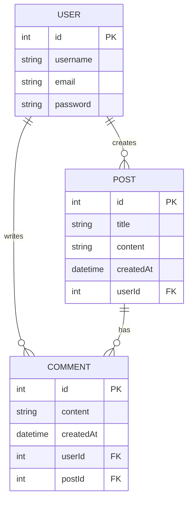

## Diagramme de la base de données

```mermaid
erDiagram
    USER {
        int id PK
        string username
        string email
        string password
    }
    POST {
        int id PK
        string title
        string content
        datetime createdAt
        int userId FK
    }
    COMMENT {
        int id PK
        string content
        datetime createdAt
        int userId FK
        int postId FK
    }
    USER ||--o{ POST : creates
    USER ||--o{ COMMENT : writes
    POST ||--o{ COMMENT : has
```
